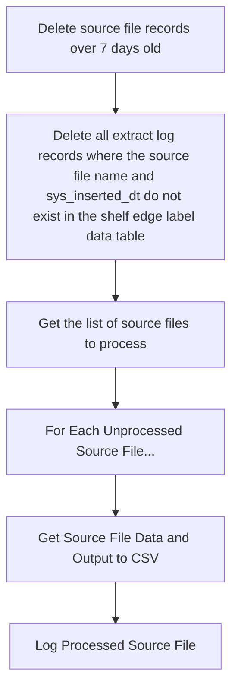

# Relex Shelf Edge Label Output

Extracts Shelf Edge Label data from database originally populated from file extract from Relex. Exports as CSV file with .txt extension for import into PDI.

Data is loaded from file into the database for ease of processing.

# Architecture

Program: SSIS

Databases: Microsoft SQL

# Scheduled Jobs

|Job|Environment|Type|SSIS Server|Frequency|Time|
|---|---|---|---|---|---|
|RelexShelfEdgeLabelsOutput|Tempe Production|JAMS|PHXW16Q11|Daily|TBD
|RelexShelfEdgeLabelsOutput|Toronto Production|???|CA1PRSPW1601|Daily|TBD
|RelexShelfEdgeLabelsOutput|Laval Production|???|LVLPRSPW1601|Daily|TBD


# Objects for package RelexShelfEdgeLabelsOutput

## Output File Naming Convention

RelexShelfEdgeLabels_IN_yyyymmddhhmmss.txt

## Destinations

__Tempe:__ \\PDIFS\EntData\Imports\IN\Relex\

__Toronto:__ \\macs.local\pdientPRD\Internal\Com\Relex\in

__Laval:__ \\couche-tard.local\PDISharePRD\Internal\Com\Relex\in

## Sources

__SQL Server Sources:__

|Location|Environment|Server Name|
|---|---|---|
|__Tempe__|Dev|PDIENTSQLDEV2.corp.circlek.com
|__Tempe__|Prod|PDIREPLICA.corp.circlek.com
|__Toronto__|Dev|PDIREPLICA.corp.circlek.com
|__Toronto__|Test|CA1PCNTW3602.macs.local
|__Toronto__|Prod|CA1PCNPW1603.macs.local
|__Laval__|Dev|LVLPDEDW3601.couche-tard.local
|__Laval__|Test|LVLPCNTW3601.couche-tard.local
|__Laval__|Prod|LVLPCNPW1603.couche-tard.local

__Database for all environments:__ CK_Reporting

__Tables:__
* dbo.relex_outbound_shelf_edge_labels
* dbo.relex_outbound_shelf_edge_label_extract_log

__Stored Procedures:__
* dbo.SSIS_RelexShelfEdgeLabel_DataMaintenance
* dbo.SSIS_RelexShelfEdgeLabelExtract

__Process Steps:__

* Package will will delete all shelf edge label records and log file entries over 7 days old
* Package will determine any source files that have not been extracted at run time
* Package will extract one PDI SIIMPS file per source file




# Details

__Step: Execute SQL Statment Task: Data Table Maintenance__
```
__EXEC dbo.SSIS_RelexShelfEdgeLabel_DataMaintenance__
```
- Stored procedure will delete all records from dbo.relex_shelf_edge_labels where the sys_inserted_dt, converted to a date value, is more than seven days old
- Stored procedure will delete all records from dbo.relex_shelf_edge_label_extract_log where no records in the relex_shelf_edge_labels database match the source_file_name and sys_inserted_dt

__Step: Execute SQL Statement Task: Get Source Files to Process__

Selection:
```
SELECT DISTINCT sel.source_file_name, sel.sys_inserted_dt
FROM dbo.relex_outbound_shelf_edge_labels sel
WHERE NOT EXISTS
(
	SELECT 1
	FROM dbo.relex_outbound_shelf_edge_label_extract_log l
	where  l.source_file_name = sel.source_file_name AND l.sys_inserted_dt = sel.sys_inserted_dt
)
ORDER BY source_file_name DESC;
```
__Step: ForEach Loop: For Each Unprocessed Source File__

__Data Flow Task: Get Data and Output to CSV__

__OLE DB Source:__

Selection based on query variable, where the SourceFileName variable and the SysInsertedDt variable are populated from the previous query in the ForEach loop
```
"EXEC dbo.SSIS_RelexShelfEdgeLabelExtract @sourceFileName = '" + @[User::SourceFileName] + "', @sysInsertedDt = '" + @[User::SysInsertedDt] + "';"
```
__Flat File Destination:__

File destination is a variable comprised of the root file location (specified in the __Destinations__ section above), and the file naming convention, where yyyymmddhhmmss is replaced with the current timestamp.

__Example File Destination:__ \\PDIFS\EntData\Imports\IN\Relex\RelexShelfEdgeLabels_IN_20250910083035.txt

__Step: Execute SQL Statement Task: Log Processed Source File__
Inserts log entry based on query variable, where the SourceFileName variable and the SysInsertedDt variable are from the ForEach loop
```
"INSERT INTO dbo.relex_outbound_shelf_edge_label_extract_log ( source_file_name, sys_inserted_dt, extracted_tsp ) VALUES ('" + @[User::SourceFileName] + "', '" + @[User::SysInsertedDt] + "', GETDATE() );"
```

# Deployment 

__Tempe Production__
* Open a RDP session on the Integration Server requested (i.e., PHXW16Q11)
* Copy .dtsx file from your local Git repository into remote folder D:\SSIS\PDI\Relex
* Start SSMS 2016 as administrator
* Connect to PHXW16Q11 using integration services
* Go to Stored Packages > MSDB > PDI > Relex
* Right-click on RelexShelfEdgeLabelOutput and select Import Package
* Locate the .dtsx file and load it

__Toronto Production__
* Open an SSMS session and connect to the Database Engine for the Integration Server requested (i.e., CA1PRSPW1601)
* Expand the Integration Services Catalog folder node
* Expand the SSISDB Catalog node
* Expand the MacsOther_Packages node
* Expand the Projects folder node
* Right-click the Projects folder node and select Import Packages
* Use the wizard to import the RelexShelfEdgeLabelOutput package from your local Git repository

__Laval Production__
* Open an SSMS session and connect to the Database Engine for the Integration Server requested (i.e., CA1PRSPW1601)
* Expand the Integration Services Catalog folder node
* Expand the SSISDB Catalog node
* Expand the PDI folder node
* Expand the Projects folder node
* Right-click the Projects folder node and select Import Packages
* Use the wizard to import the RelexShelfEdgeLabelOutput package from your local Git repository

# Contacts

|Team|&nbsp;|Email|
|---|---|---|
|Business Analyst|Sunshine Kuhlman|skuhlma@circlek.com
|&nbsp;|Ron Schofield|ronald.schofield@couche-tard.com
|Build Team &amp; Support|Eric Scott|eric.scott@circlek.com;
|&nbsp;|Ron Schofield|ronald.schofield@couche-tard.com
|&nbsp;|Sunshine Kuhlman|skuhlma@circlek.com
